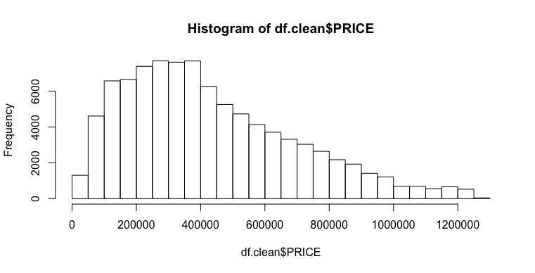
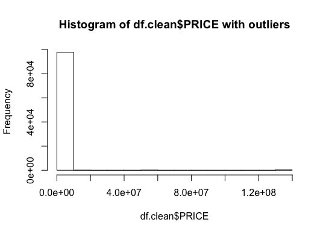
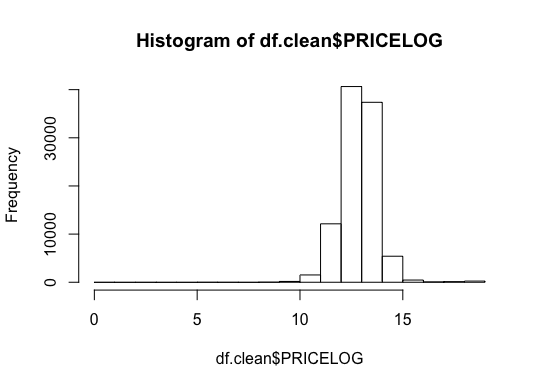

## Abstract

The residential property descriptions and address point information is current as of July 2018 and is provided by D.C. Geographic Information System

## Eda


At first look:

- there are some columns that can't be used directly : FULLADRESS, CENSUS_BLOCK, SQUARE, X, Y (the last two are the same with latitude and longitude) 
- Some fields need processing. Like sell date into year and zipcode into categorical
- few colummns have NA VALUEs


### Types of data

```
table(sapply(df, class))
```

| factor       | integer | numeric |
|--------------|---------|---------|
| 23           | 11      | 15      |

### Looking at the target feature

There are 4655 outlier values. (what should with do with them?). First I removed it




### What type of variation occurs within my variables?

First we look at the price column, the value that I try to predict


{width=50%} {width=50%}
  {width=50%} 


{width=50%} {width=50%} 
{width=50%} {width=50%}
{width=50%} {width=50%} 
{width=50%} {width=50%}


### What type of covariation occurs between my variables?

### Missing Values

We are looking to the columns that are missing most of the values


| Column             | Percentage |
|--------------------|------------|
| NUM_UNITS          | **41.048** |
| AYB                | **0.114**  |
| YR_RMDL            | **41.278** |
| STORIES            | 41.082     |
| SALEDATE           | **0.001**  |
| GBA                | 41.048     |
| STYLE              | 41.048     |
| STRUCT             | 41.048     |
| GRADE              | 41.048     |
| CNDTN              | 41.048     |
| EXTWALL            | 41.048     |
| ROOF               | 41.048     |
| INTWALL            | 41.048     |
| KITCHENS           | **41.049** |
| CMPLX_NUM          | 58.952     |
| LIVING_GBA         | 58.952     |
| CITY               | 41.385     |
| STATE              | 41.385     |
| NATIONALGRID       | 41.385     |
| ASSESSMENT_SUBNBHD | 20.623     |
| QUADRANT           | **0.103**  |


From the columns with missed values I will keep only the following columns:  

- AYB, SALEDATE, QUADRANT (they miss only few values and I can drop the rows)
- KITCHEN,NUM_UNITS - can be imputed
- YR_RMDL - can be calculated from AYB 
- LIVING_GBA - can be imputed from GBA
- GBA - can be imputed from LIVING_GBA


### Covariation

Varianta between columns can be seen in the figure below


** With target predictor: PRICE ** 


** Continouse 

** Categorical **


Let's see how categorical columns coralate with PRICE column 


{width=50%} {width=50%}
{width=50%} {width=50%} 
{width=50%} {width=50%} 
{width=50%} {width=50%}

We can see that per neighbourhod price range differs so we we zoom it a little bit per median price

 
 


## Data processing

From 158957 properties, only 98216 had price so all the analysis was made starting with this subset of data


