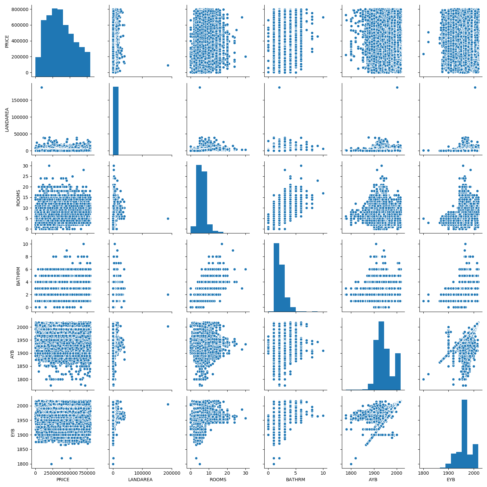
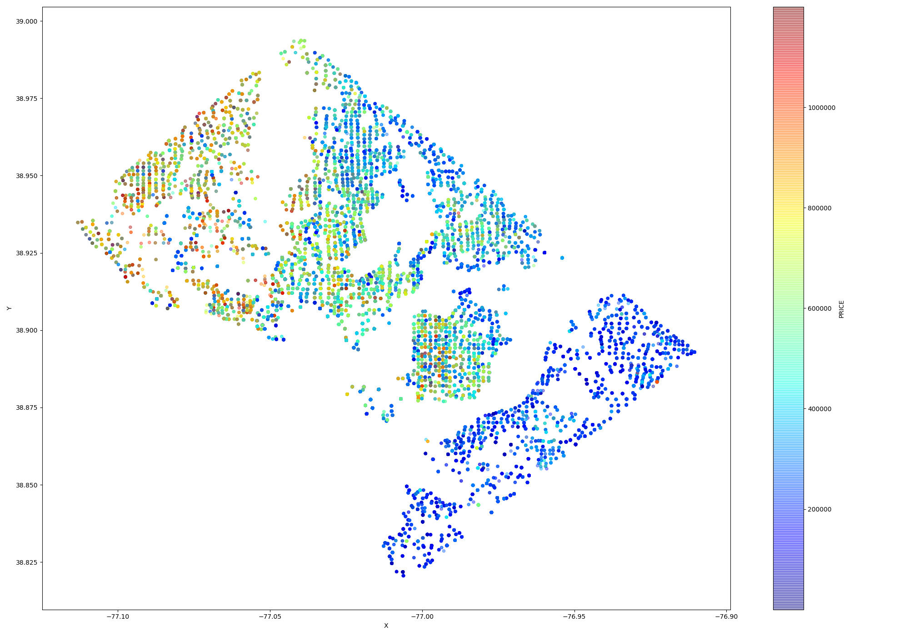
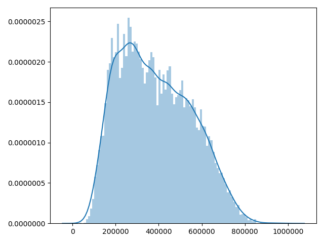
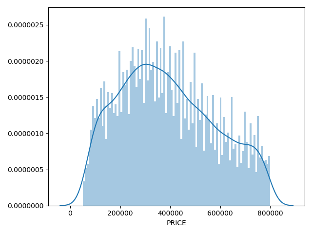

## Abstract

In this paper I try to predict the prices of houses for Washington DC residential Area based on the records that are public on Kaggle.com


## The Data Set

The residential property descriptions and address point information is current as of July 2018 and is provided by D.C. Geographic Information System


The main columns of the data are

- ID
- BATHRM -  Number of Full Bathrooms
- HF_BATHRM -  Number of Half Bathrooms (no bathtub or shower)
- HEAT -  Heating
- AC  -  Cooling
- NUM_UNITS - Number of Units
- ROOMS  -  Number of Rooms
- BEDRM  -   Number of Bedrooms
- AYB  -  The earliest time the main portion of the building was built
- YR_RMDL - Year structure was remodeled
- EYB - The year an improvement was built more recent than actual year built
- STORIES Number of stories in primary dwelling
- SALEDATE  -  Date of most recent sale
- PRICE  -   Price of most recent sale
- QUALIFIED - Qualified
- SALE_NUM - Sale Number
- GBAG  -  ross  building area in square feet
- BLDG_NUM - Building Number on Property
- STYLE - Style
- STRUCT  -  Structure
- GRADE -  Grade
- CNDTN -  Condition
- EXTWALL -  Extrerior wall
- ROOF -  Roof type
- INTWALL -  Interior wall

## Eda


At first look:

- there are some columns that can't be used directly : FULLADRESS, CENSUS_BLOCK, SQUARE, X, Y (the last two are the same with latitude and longitude) 
- Some fields need processing. Like SALEDATE into year and zipcode into categorical
- few colummns have `NA` VALUEs


### Types of data

```
table(sapply(df, class))
```

| factor       | integer | numeric |
|--------------|---------|---------|
| 23           | 11      | 15      |


## Data analysis

From 158957 properties, only 98216 had price so all the analysis was made starting with this subset of data


### Missing Values

We are looking to the columns that are missing most of the values


| Column             | Percentage |
|--------------------|------------|
| NUM_UNITS          | **41.048** |
| AYB                | **0.114**  |
| YR_RMDL            | **41.278** |
| STORIES            | 41.082     |
| SALEDATE           | **0.001**  |
| GBA                | 41.048     |
| STYLE              | 41.048     |
| STRUCT             | 41.048     |
| GRADE              | 41.048     |
| CNDTN              | 41.048     |
| EXTWALL            | 41.048     |
| ROOF               | 41.048     |
| INTWALL            | 41.048     |
| KITCHENS           | **41.049** |
| CMPLX_NUM          | 58.952     |
| LIVING_GBA         | 58.952     |
| CITY               | 41.385     |
| STATE              | 41.385     |
| NATIONALGRID       | 41.385     |
| ASSESSMENT_SUBNBHD | 20.623     |
| QUADRANT           | **0.103**  |


From the columns with missed values I will keep only the following columns:  

- AYB, SALEDATE, QUADRANT (they miss only few values and I can drop the rows)
- KITCHEN,NUM_UNITS - can be imputed
- YR_RMDL - can be calculated from AYB 
- LIVING_GBA - can be imputed from GBA
- GBA - can be imputed from LIVING_GBA


### What type of variation occurs within my variables?

First we look at the price column, the value that I try to predict. 


{width=33%} {width=33%}   {width=33%} 

The `PRICE` column has  4655 outlier values.  An option would be removed them as they represent less than 5% of data


**Numerical**

{width=33%} {width=33%} {width=33%}
{width=33%} {width=33%} {width=33%}
{width=33%} {width=33%} {width=33%}
{width=33%} {width=33%} {width=33%}
{width=33%} {width=33%} {width=33%}


A couple of feature have large outliers

**Categorical** 

{width=50%} {width=50%} 
{width=50%} {width=50%}
{width=50%} {width=50%} 
{width=50%} {width=50%}


### What type of covariation occurs between my variables?


Variation  between columns can be seen in the figure below


Choosing most important features would show us in detail how these features relate to each other: 




Let's see how categorical columns coralate with PRICE column 


{width=50%} {width=50%}
{width=50%} {width=50%} 
{width=50%} {width=50%} 
{width=50%} {width=50%}


We can see that per neighbourhod price range differs so we we zoom it a little bit per median price


##PCA

From numerical features only 4 components explain 99% of the variance


### Some intesting plot: plot Map




Observation: we can see that North-West has expensive houses


### Data processing

After EDA some data processing is required
- remove columns with no variation
- remove outliers regarding columns PRICE, FIREPLACES, LANDAREA
- add a couple feature engineering columns: ratio between bedrooms and rooms, stories and living area, years of house since build , yeards of house since remodeled


## Regression Models

### Linear Regression

Different combinations of features and feature price tranformations, but this model is too simple for such data  

| name       | EV    | MAE       | r2    | RMSE      | max_error   |
|------------|-------|-----------|-------|-----------|-------------|
| lin_simple | 0.55  | 97268.36  | 0.55  | 127492.14 | 2458603.92  |
| lin_log10  | 0.53  | 0.13      | 0.53  | 0.17      | 1.61        |
| lin_sqrt   | 0.55  | 81.21     | 0.55  | 105.79    | 1457.71     |
| lin____log | 0.53  | 0.3       | 0.53  | 0.4       | 3.7         |
| lin_comb0  | 0.24  | 125093.19 | 0.24  | 165680.56 | 5743210.07  |
| lin_comb1  | -0.14 | 137774.93 | -0.14 | 202373.04 | 12692410.06 |
| lin_comb2  | 0.31  | 122764.38 | 0.31  | 157340.08 | 3997288.0   |
| lin_comb3  | 0.43  | 110459.09 | 0.43  | 142531.27 | 675468.0    |
| lin_comb4  | 0.26  | 129887.61 | 0.26  | 163364.18 | 3291952.0   |
| lin_comb5  | 0.46  | 107613.75 | 0.46  | 139188.01 | 1176272.28  |


### GradientBoost

Gradient boosting is a machine learning technique for regression and classification problems, which produces a prediction model in the form of an ensemble of weak prediction models, typically decision trees.


| name       | EV   | MAE       | r2   | RMSE      | max_error |
|------------|------|-----------|------|-----------|-----------|
| gradsimple | 0.7  | 77878.03  | 0.7  | 104299.53 | 663640.63 |
| gradlog10  | 0.65 | 0.11      | 0.65 | 0.15      | 0.9       |
| gradsqrt   | 0.69 | 66.52     | 0.69 | 88.92     | 532.51    |
| xg_400_log | 0.65 | 0.25      | 0.65 | 0.34      | 2.08      |
| grad_comb0 | 0.47 | 107406.77 | 0.47 | 137976.15 | 530732.41 |
| grad_comb1 | 0.45 | 109735.75 | 0.45 | 140046.31 | 553400.78 |
| grad_comb2 | 0.5  | 103469.16 | 0.5  | 133469.4  | 558932.02 |
| grad_comb3 | 0.55 | 97318.09  | 0.55 | 127395.34 | 557618.39 |
| grad_comb4 | 0.54 | 98072.06  | 0.54 | 127839.75 | 540362.36 |
| grad_comb5 | 0.55 | 97247.4   | 0.55 | 126860.91 | 542116.1  |


### RandomForest


Random forest is a Supervised Learning algorithm which uses ensemble learning method for classification and regression. Random forest is a bagging technique and not a boosting technique. The trees in random forests are run in parallel.


Running simple classifiers we get these results

| name         | MAE       | r2    | RMSE      | max_error |
|--------------|-----------|-------|-----------|-----------|


After trying different hyper parameters and running a randomized search on hyper parameters we get:
 
| name         | MAE       | r2    | RMSE      | max_error |
|--------------|-----------|-------|-----------|-----------|
| rf           | 156709.45 | -0.14 | 210002.65 | 635000.0  |
| rf400        | 151426.89 | -0.07 | 203276.95 | 629172.0  |
| rftune       | 137795.46 | 0.31  | 163011.09 | 490026.72 |
| rf_100_log10 | 0.14      | 0.31  | 0.18      | 0.9       |
| rf_400_log10 | 0.14      | 0.31  | 0.18      | 0.91      |
| rf_400_log   | 0.32      | 0.31  | 0.42      | 2.08      |


**Feature selection**

Different combinations were used  to test the algorithm

```

comb = [
["LANDAREA", "BEDRM", "ROOMS", "BATHRM", "HF_BATHRM", "AYB", "EYB", "FIREPLACES", "STORIES"],

["BATHRM", "HF_BATHRM", "AYB", "EYB", "FIREPLACES", "STORIES", "QUALIFIED", "CNDTN"],

["BATHRM", "HF_BATHRM", "ROOMS", "AYB", "EYB", "STORIES", "QUALIFIED", "CNDTN", "QUADRANT"],

["ATHRM", "HF_BATHRM", "ROOMS", "AYB", "STORIES", "QUALIFIED", "CNDTN", "WARD"],

["BATHRM", "HF_BATHRM", "ROOMS", "AYB", "EYB", "STORIES", " QUALIFIED", "CNDTN", "ZIPCODE"],

["BATHRM", "HF_BATHRM", "ROOMS", "AYB", "EYB", "STORIES", " QUALIFIED", "CNDTN", "ASSESSMENT_NBHD"]
]

```

Although different subset combinations were tried  there was no clear improvement

| name         | MAE       | r2    | RMSE      | max_error |
|--------------|-----------|-------|-----------|-----------|
| rf           | 156709.45 | -0.14 | 210002.65 | 635000.0  |
| rf400        | 151426.89 | -0.07 | 203276.95 | 629172.0  |
| rftune       | 137795.46 | 0.31  | 163011.09 | 490026.72 |
| rf_100_log10 | 0.14      | 0.31  | 0.18      | 0.9       |
| rf_400_log10 | 0.14      | 0.31  | 0.18      | 0.91      |
| rf_400_log   | 0.32      | 0.31  | 0.42      | 2.08      |
| rf_comb0     | 149579.1  | 0.19  | 177480.72 | 492658.65 |
| rf_comb1     | 149252.42 | 0.19  | 177435.91 | 493537.32 |
| rf_comb2     | 145243.66 | 0.23  | 172223.76 | 513858.18 |
| rf_comb3     | 145997.44 | 0.23  | 172099.83 | 507289.36 |
| rf_comb4     | 145259.06 | 0.23  | 172484.53 | 517800.21 |
| rf_comb5     | 145922.58 | 0.23  | 172585.49 | 504692.43 |


**Tuning hypermaters**

For tuning parameters different parameters were tried  
```
{
    'max_features': ['auto', 'sqrt', 'log2'], 
    'min_samples_split': array([0.1, 0.2, 0.3, 0.4, 0.5, 0.6, 0.7, 0.8, 0.9, 1. ]), 
    'max_depth': [1, 2, 3, 4, 5, 6, 7, 8, 9, 10, 11, 12, 13, 14, 15, 16, 17, 18, 19]
}
```


And got the final version of:

`{'min_samples_split': 0.1, 'max_features': 'sqrt', 'max_depth': 18}`


### XGBoost


XGBoost is an optimized distributed gradient boosting library designed to be highly efficient, flexible and portable. It implements machine learning algorithms under the Gradient Boosting framework. XGBoost provides a parallel tree boosting (also known as GBDT, GBM) that solve many data science problems in a fast and accurate way.

| name         | EV   | MAE       | r2    | RMSE      | max_error |
|--------------|------|-----------|-------|-----------|-----------|
| xgb          | 0.43 | 160083.13 | -0.09 | 197846.36 | 554660.23 |
| xgb20        | 0.65 | 86530.85  | 0.64  | 113248.39 | 545448.81 |
| xgb100       | 0.7  | 75181.37  | 0.7   | 103808.83 | 570595.81 |
| xgb100sqrt   | 0.68 | 64.89     | 0.68  | 89.02     | 517.86    |
| xg_100_log10 | 0.65 | 0.11      | 0.65  | 0.15      | 1.02      |
| xg_400_log10 | 0.63 | 0.11      | 0.63  | 0.15      | 0.93      |
| xg_400_log   | 0.63 | 0.25      | 0.63  | 0.35      | 2.41      |
| xg_comb0     | 0.45 | 105287.45 | 0.45  | 140907.3  | 679083.19 |
| xg_comb1     | 0.43 | 108694.64 | 0.43  | 143113.26 | 638272.56 |
| xg_comb2     | 0.49 | 101872.58 | 0.49  | 135876.38 | 655555.44 |
| xg_comb3     | 0.52 | 97480.49  | 0.52  | 131858.26 | 668339.5  |
| xg_comb4     | 0.51 | 97535.55  | 0.51  | 132096.97 | 651970.25 |
| xg_comb5     | 0.53 | 95647.39  | 0.53  | 129583.88 | 669786.51 |


## Pred vs Test set

{width=49%} {width=49%} !


### Conclusions

- Houses with high prices were predicted poorer 
- XGBOOST And Gradient Boosting performed very well
- more CPU power would be needed in order to hyper tune parameters. Some RandomisedSearchCV took more than 12 hours 
  